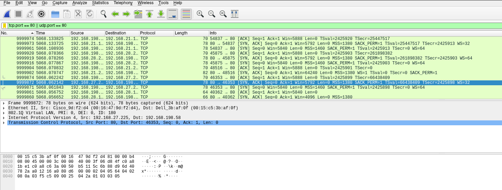
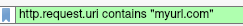
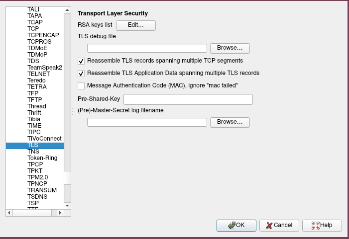

This tutorial will give an overview of packet analysis tools such as Wireshark, Tshark, TCPDump, and NGrep.

### Wireshark
Wireshark is one of the most useful tools for packet analysis, and can tell you a great deal about what is happening in a network. While it can be very time consuming to get to the useful information, and there are tools available that will automatically extract data from a packet capture they can miss things; which is why knowing how to use Wireshark is a very useful skill to have. I personally have used it in network forensics.

In the examples I will be using example PCAP files that I have taken from [netresec.com](https://www.netresec.com/?page=MACCDC).

The first thing I'll show you is a simple filter. this filter will filter for all TCP and UDP traffic going over port 80. Port 80 being the standard port for HTTP traffic. The syntax for the filter is what you see in the the green box.



For more information about the syntax here you can have a look at the [Wireshark](https://www.wireshark.org/) website or the [Berkley Packet Filters (BPF)](http://biot.com/capstats/bpf.html) website. BPF is the syntax used in Wireshark filters, it's also used by other packet analysers. 

You can search for specific URL's in Wireshark:



#### Decrypt TLS With Wireshark

Using Wireshark you can decrypt SSL traffic There are two methods available. 

For the first you must have the SSLKEYLOGFILE;  you have to generate this prior to you needing to decrypt the traffic. If you do not have this you won't be able to decrypt the SSL traffic.

1. Go to Wireshark -> Edit -> Preferences -> Protocols -> TLS



2. Under "(Pre)-Master-Secret log filename" select browse. Find the SSLKEYLOGFILE you created previously and select that.

It's as simple as that. All SSL traffic that host and another will be visible and decrypted in Wireshark.

The second method requires you to have the private key.

1. Go to Wireshark -> Edit -> Preferences -> Protocols -> TLS (See above image).
2. Under RSA keys list click "Edit".
3. Enter the IP of the server with the private key.
4. Port - This is normally 443 for SSL or TLS traffic.
5. Protocol - Normally HTTP.
6. Key File - This is the private key for the TLS traffic.
7. Password - Password that was assigned when exporting the key file. This may not be applicable in all scenarios.


#### File Extraction in Wireshark

Like with TLS decryption file extraction is fairly simple, only you can do this without prior work on the host device.

1. Find the stream you would like to extract a file from.
2. Go to File -> Export Objects
3. Choose the appropriate protocol (SMB, HTTP, etc.)
4. Choose the specific file you want, or choose to save all.

**N.B. This will only work if Wireshark recognises the file headers of the file you want to extract. If the header is not standard then Wireshark won't recognise the filetype and you will have to manually extract.**

It is a fairly simple obfuscation technique to alter the file headers to make them unreadable to simple processes like this.

#### Packet Searching in Wireshark
Wireshark can be used to search packets. This can be used to search for file headers, if you think some are being altered somehow.

1. Go to Edit -> Find Packet *OR* CTRL+F
2. Specify how you want to search i.e. string or hex.
3. Now select the part of the packet to search i.e. list, details, bytes.
<br/><br/>

### TCPDump
TCPDump is a is a fairly simple tool used for capturing packets on a network. You can also use it for limited analysis of .pcap files.

To capture files you can use one of the following command:

```bash
tcpdump -i eth0 -w <mypackets.pcap>
```
* *-i* - This selects the network interface.
* *-w* - This writes the output to the specified file.

This is just one command you can run to capture files. There are many other ways you can capture packets like filtering for certain protocols or hosts.

To list all of your available interfaces:

```bash
tcpdump -D
```

The following commands are those you can use to read and filter .pcap files.

```bash
tcpdump -r <mypackets.pcap>
```
* *-r* - This reads a pcap file.

```bash
tcpdump -X
```
* *-X* - Displays ASCII & Hexadecimal representations of packet contents.

```bash
tcpdump -r <mypackets.pcap> src <myip> port 80
```
* *src* - Allows you to specify that only a certain IP is show in the output.
* *port* - Allows you to specify that only a certain port is shown in the output.
<br/><br/>

### NGREP
NGREP is a GREP tool for .pcap files.

```bash
ngrep -I <mypackets.pcap> "POST"
```
* *-I* - is used for files

This command will search through the file looking for the pattern "POST".

**N.B. NGREP also works with REGEX patterns.**

With NGREP the *#* symbol denotes the number of packets associated with a BPF match. *-q* will disable this functionality.

The below simply illustrates the use of BPF syntax in NGREP:

```bash
ngrep -I <mypackets.pcap> "POST" host '192.168.1.1'
```

```bash
ngrep -I <mypackets.pcap> "POST" port '192.168.1.1'
```


### TSHARK
TSHARK is a command line version of Wireshark. It can be quicker at analysing large .pcap files than TCPDUMP as it uses the same syntax as Wireshark filters. TSHARK can also analyse traffic from USB drives.  

* *-i* - Starts a capture on a specified interface.

```bash
tshark -r <mypackets.pcap> -Y <WiresharkDisplayFilter>
```
* *-r* - Reads from a file.
* *-Y* - Allows you to specify a display filter.

```bash
tshark -r <mypackets.pcap> -Y <Wireshark display filter> -T fields -e <fieldNames>
```
* *-T* - Determines the text output format.
* *-e* - Allows you to specify which fields of a packet to print.

```bash
tshark -r <mypackets.pcap> tcp.port==80 || udp.port==80
```
As with Wireshark you can use BPF syntax for queries.