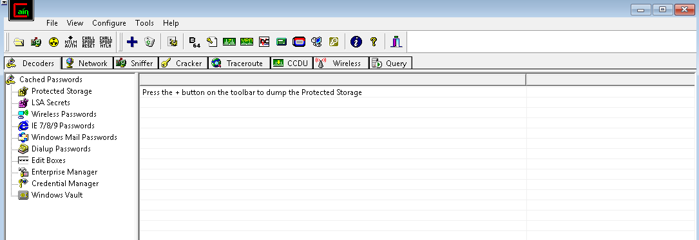
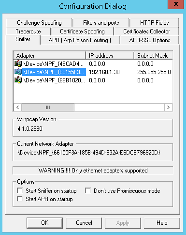
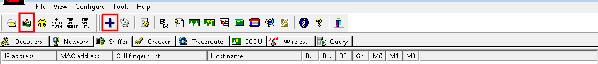
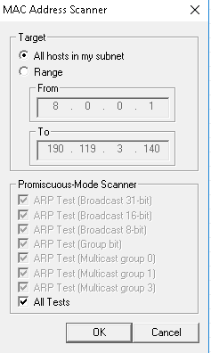
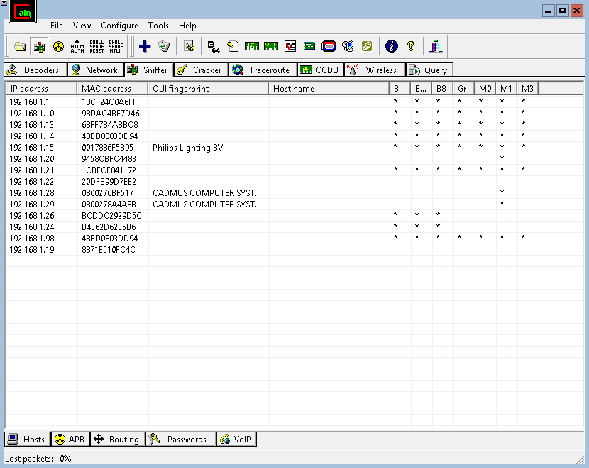
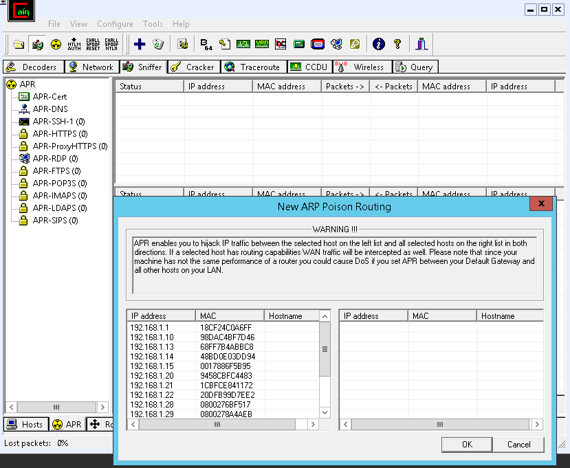
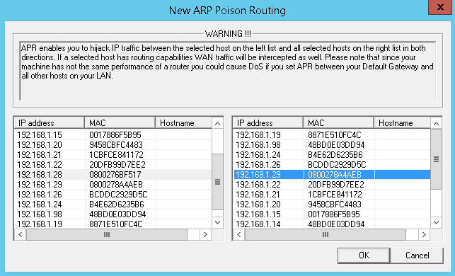
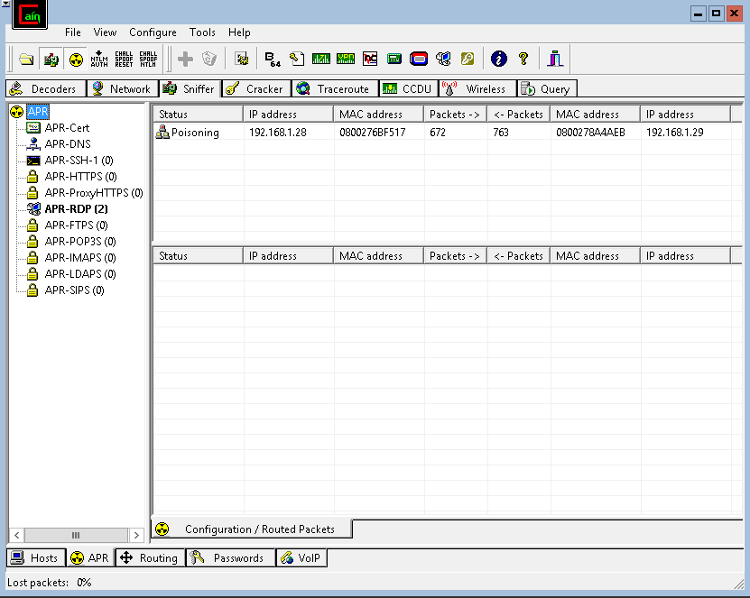

Cain and Abel is a great tool for performing Man-In-The-Middle (MITM) attacks. This will allow you to sniff traffic on the network and conduct an ARP poisoning attack. 

Cain and Abel is a Windows tool, when you first launch it it looks like the below:

You'll have to configure the network adapter yourself. To do this click on the Configure button at the top and you'll see the following popup.

As we'll be sniffing we'll stick to the first tab (Sniffer) select our adapter then hit Apply and OK.

Now we'll have to activate sniffing. First we'll go to the 'Sniffer' tab. Then we will 'Start/Stop Sniffer' and 'Scan MAC Addresses', the picture below highlights which buttons these are. 

Once you've done this you should see a menu pop up. We're going to perform all scans on all hosts in the subnet, this makes it nice and easy for our first scan. 

This scan will take a little time. Once it's completed you'll see something like the below.

We're now going to move to the APR tab at the bottom and start to perform the poisoning. Click anywhere in the top half of the new screen, then click the plus button again.

Here we'll select the two IP addresses we would like to sit in between.

Once you've done that you must click the 'Start/Stop APR' button:

As traffic goes between the two hosts you will see the packet count increase. 

If passwords are exchanged during your time as the MITM you will be able to see them in the Passwords section. 

This gives you a brief insight into what Cain and Abel is capable of.