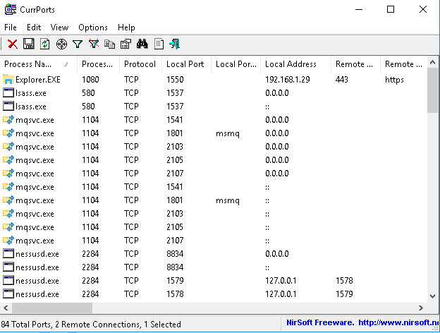
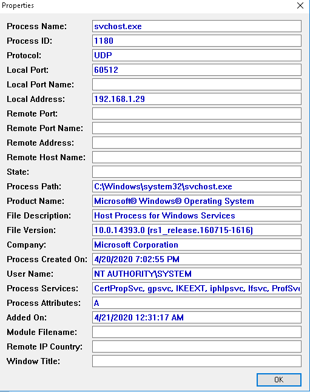

CurrPorts is a tool that can help you analyse processes and the network ports they are using. This can be useful to help you troubleshoot problems, better understand your network usage, or analysing viruses to understand how they're calling back to a command and control server.

The UI is fairly simple. You can see the process name, the port it's using, and the IP address it's talking to. You can also close out TCP connections if you want to stop them for any reason; this may break the running process.

You can also view more detailed information about a process by right clicking and going to properties.

