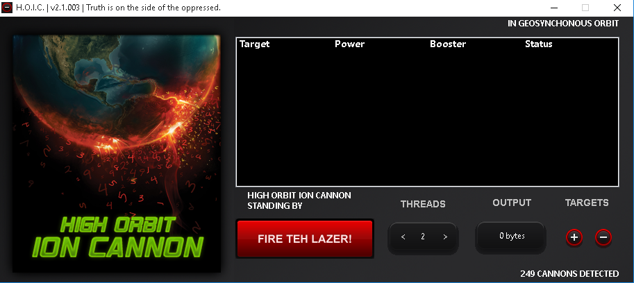
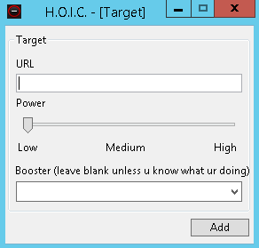
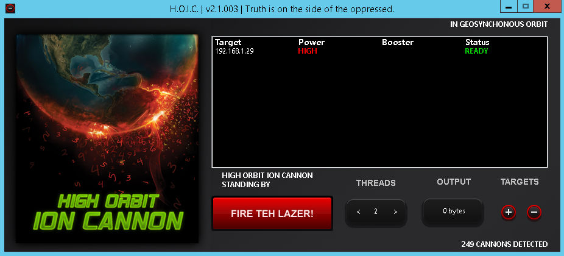

The High Orbit Ion Cannon (HOIC) is a tool used to perform Distributed Denial of Service (DDoS) attacks. This tools allows you to create scripts to avoid some anti-DDoS protection features employed by certain organisations.

The UI is pretty simple when you first open it.

To allow HOIC to perform a DDoS attack you'll have to have multiple devices available to you. You have to manage the tool from the individual hosts, you can't centrally manage it with the tool as it is. 

To target a device you simply press the *+* button near the bottom right. This brings up the window for you to enter in the URL and the 'power'. The booster is where you would add your own *.hoic* file to avoid DDoS protection systems; I won't be adding one myself.

Once you've added the URL it should look like this.

Now all that's left to do is set the number of threads and *'FIRE TEH LAZER!'*. The threads will increase the potency of the attack.

Depending on the number of machines and the settings you use once you initiate the attack you might notice a degradation in the target's performance or it may even completely stop. 

*N.B. Whether you're doing this in a lab environment or not you should be carful. You can potentially bring down your own network if you accidentally target the wrong machine.*