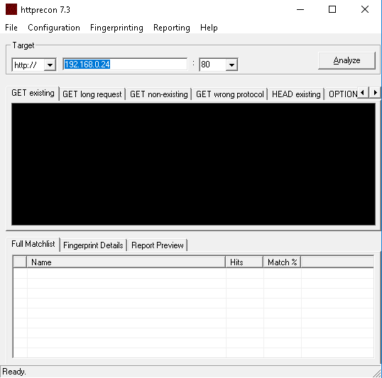
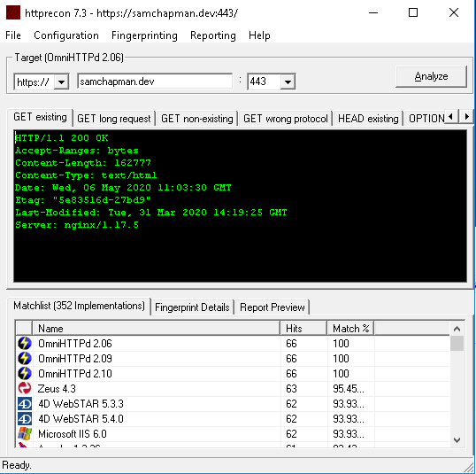
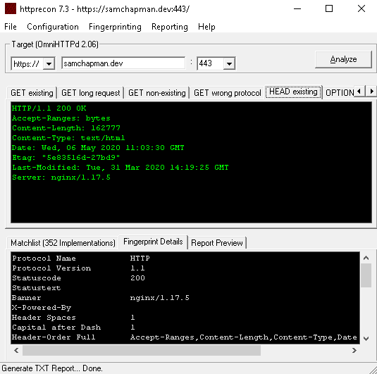

HTTPRecon allows you to fingerprint a web server to give you a better understanding on how it's configured. This can therefore be used in the initial stages of an attack on a web server. The tool is run on Windows so that's what I'll be using it on.

The UI is fairly simple.

To start fingerprinting a web server simply enter the URL and port number, then hit analyze. Remember if you're scanning https set the port to 443, the default https port.

Once the scan is complete you should see something like this:

The 'Fingerprint Details' and 'Report Preview' tabs give you a little more information based on the server's response.

If you would like to see further details about the other request types sent by HTTPRecon click one of the other tabs at the top and view the 'Fingerprint Details' tab, as shown below:

There isn't a lot of information shown by this tool, however, it does allow you to narrow your search for vulnerabilities to specific servers and server versions when performing a penetration test.