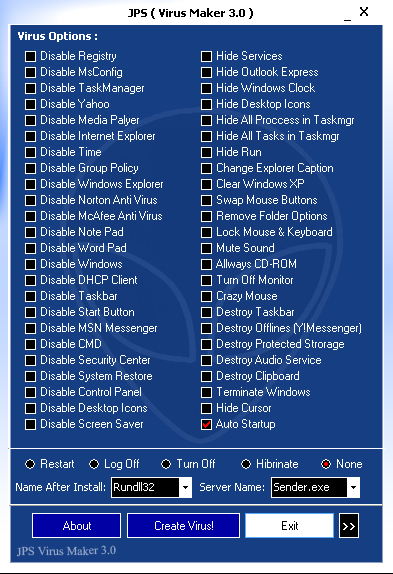
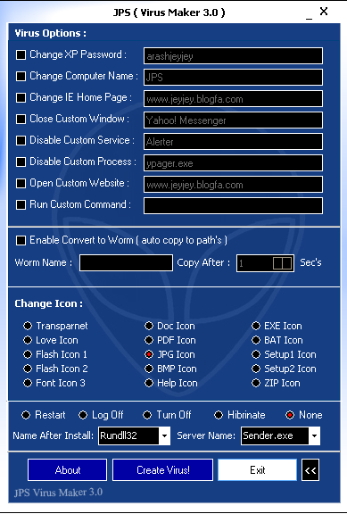

JPS is a tool for creating viruses. It's fairly simple and easy to use but a fairly well-known tool so easy to spot with an antivirus.

When you open it you'll be greeted with the below UI.

I'm sure you'll notice from some of the options that the tool is quite old. Things like disabling MSN might not be useful, but most of the other features are still good and should still work.

Clicking on the '>>' button will reveal a further menu.

Once you've selected the options you want you can click 'Create Virus'. This will create the virus in the current folder with the name you'd given it. Now you can package the virus up and send it on to your unsuspecting victim.