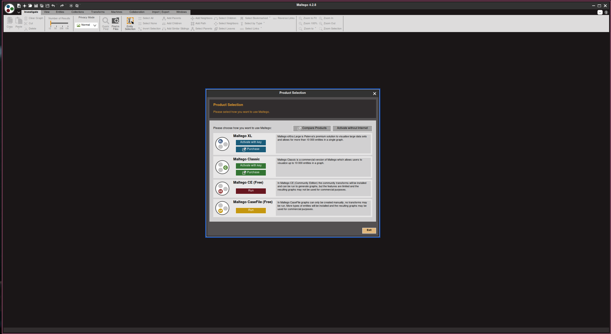
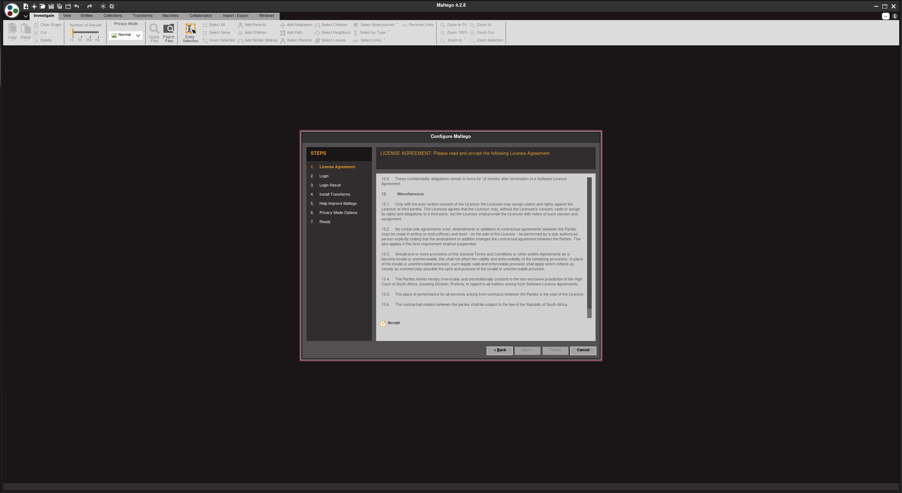
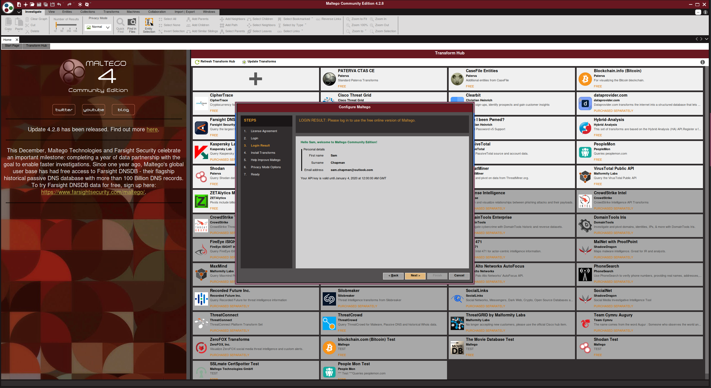
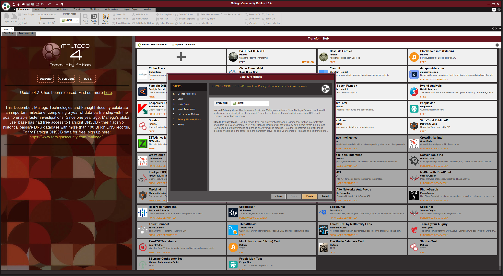
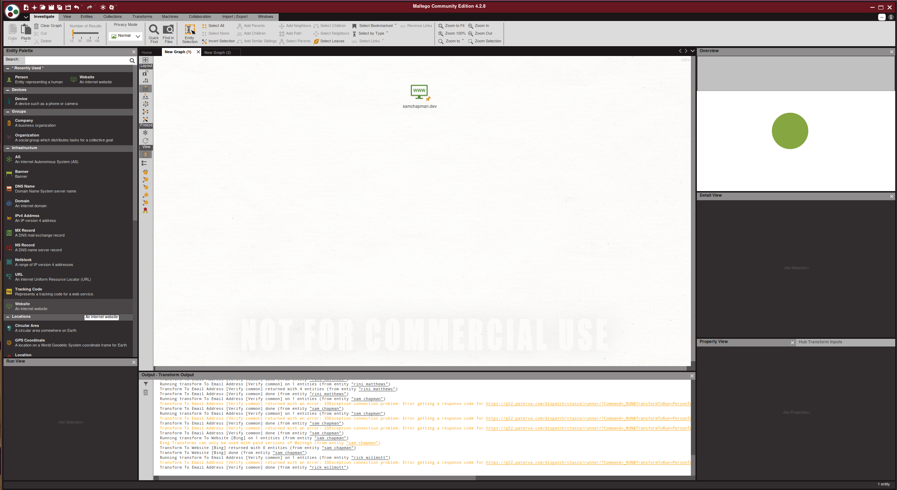
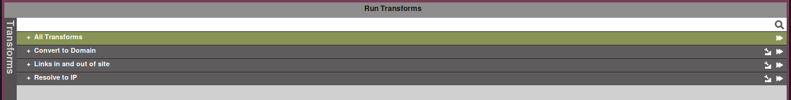
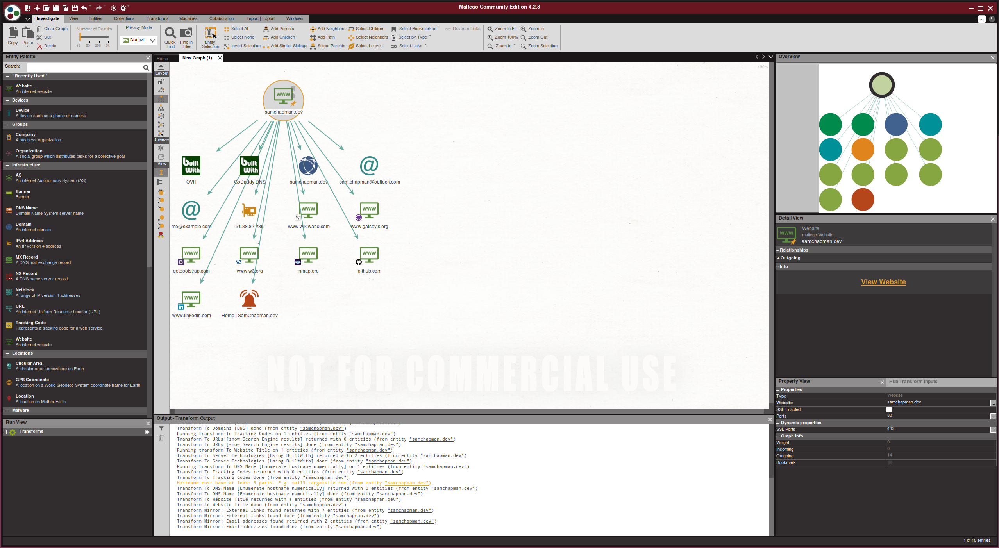

Maltego is a really powerful tool used to find scrape the internet for information, whether thats about a person, website, device, or anything else that it does.

First comes the brief setup phase. Once you've installed it you'll need to go through the fairly brief setup phase. This is fairly self-explanatory, but the below screenshots show some of the steps.

I won't go through each of the setup phases, as I'm sure you can cope with these steps. As a note though I'm using the CE version in normal mode, just incase there are differences in the other versions/modes.

##### Usage
Now we've setup Maltego, we're going to use it. There are so many options with it I'm not going to describe each one, as I'm sure you can experiment yourselves.

In the above step, I dragged over the website node from the infrastructure section. I then double clicked on the default option and entered in this site. Please don't test Maltego on my site :).

From there you can right click the node and bring up the following menu. If you click the button on the far right you will run all of the sub-transforms under that transform, or you can select something more specific.

If you run all transforms you will get as much information as Maltego can provide, as shown above.