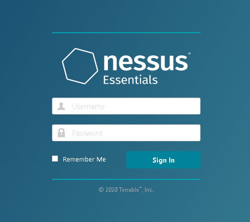
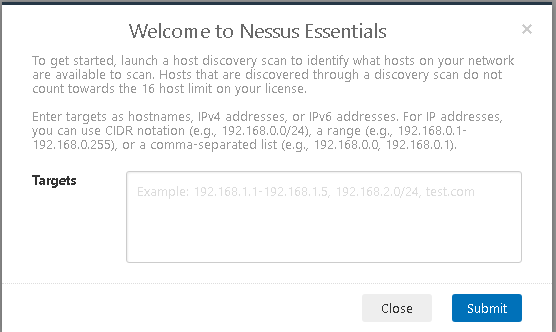
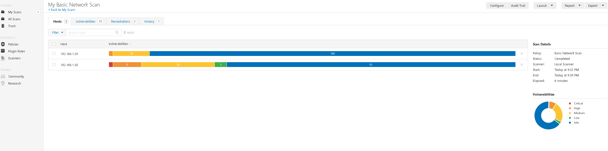
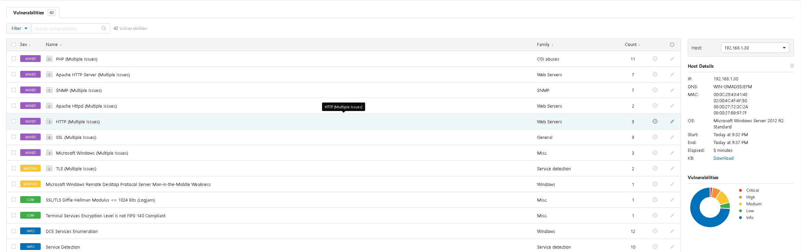
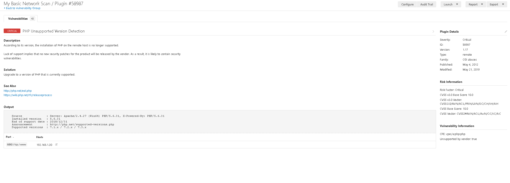
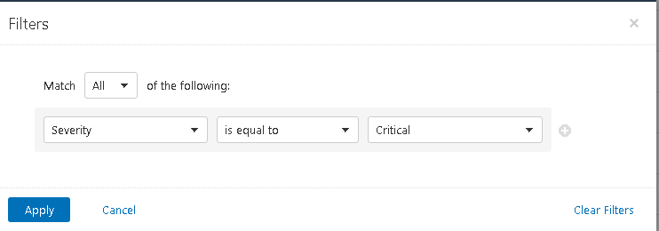
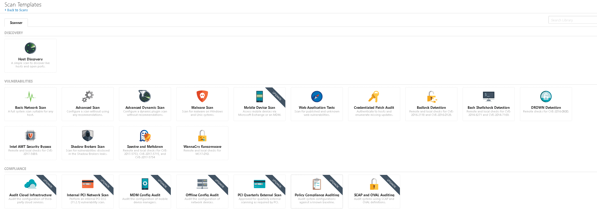
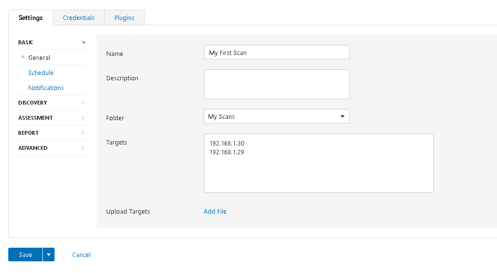
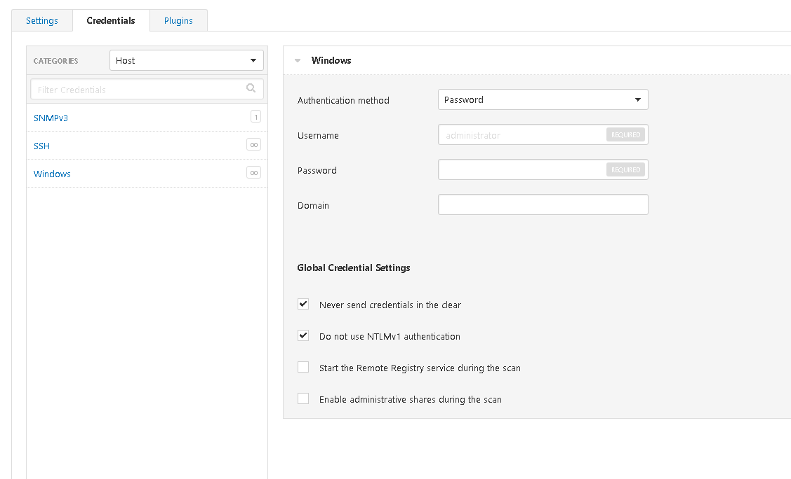

Nessus is one of the industries most well know vulnerability scanners, there are plenty of others out there but this one is one that I've used most. Vulnerability scanners are great for detecting whether a system/network is vulnerable to 'known' vulnerabilities. This isn't about zero-days, which is what the industry reports most on. Generally attacks are performed because a system is not up to date with the latest patches, it has been misconfigured, or it is using default credentials; this is why it's important too know where your vulnerabilities are.

You can download and install Nessus from the Tenable website. This is a paid for solution normally used by enterprises or vulnerability management organisations, but you can utilise Nessus Essentials to test with. Nessus Essentials is a version specifically designed to use to test out the tool and is therefore limited in the number of nodes it can scan but for your own personal use it's ideal. If your setting up for the first time, the process is pretty self explanatory, however, it does take a while for it to fully install.

Once Nessus Essentials has been installed you will be greeted by the below logon screen (You should have setup a username and password during the installation).

Upon your first logon you will be asked to perform a host discovery scan. This will detect hosts on your network to get an initial understanding, it's not completely necessary but if this is a new network to you it can be quite a useful step.

If you're using Essentials you will have to pick the hosts you'd like to scan. Remember you're limited to 16 hosts on this license. Once the scan is complete you'll see a report similar to the below:

At the top of the scan results you can see different tabs. The first two are methods of broadly filtering the vulnerabilities, you can either do it by host, as depicted, or by vulnerability. The vulnerability view displays the vulnerabilities with the number of hosts it affects. 

The remediations tab shows you how to resolve certain vulnerabilities, this could be to install software and in some cases a remediation may resolve multiple vulnerabilities. 

The history tab shows previous scans, here you can select a previous scan and see which vulnerabilities were present then; this is useful if you need to report on how many vulnerabilities have been remediated over time.

If I click on a host I'll see a list of vulnerabilities affecting in:

Some of these show  multiple issues. In these cases the vulnerabilities can be catergorised as a specific service, or application such as PHP. Upon clicking on these you will see a further breakdown:

When you've narrowed the selection to a specific vulnerability you can see a full description and more detailed information regarding a remediation. This page also points you to articles further describing the vulnerability and remediations. 

The filter tool is useful for reducing the number of vulnerabilities being shown, especially when you want to focus on a specific type or severity.

#### Creating New Scans
This standard scan gives you some good information, but you will likely want to tailor a scan to your specific needs. To create a new scan go to the 'My Scans' page and click 'New Scan'. You will be presented by a screen similar to the below:

Here you have a lot of choice, some more specific than others. If you're just doing a general scan to understand the state of you're network it would be useful to select the "Advanced Scan" as this is the most comprehensive scan and requires little configuration.

Once you've selected your scan type you'll see the configuration screen. You'll need to tailor this to your requirements.

You can setup a scanning schedule and how the results get to you, but I won't show these as they're self-explanatory. The other setting along the left hand side allow you to tailor the scan further to your needs. 

Along the top are 2 other tabs. The 'Plugins' tab allows you to select the different Nessus modules to scan the targets with. Some scan types do not have this option, running all the scanning modules can take a while so selecting specific ones can be quite helpful to reduce time and impact on the targets.

The credentials tab allows you to enter credentials for the scan. This is especially useful when doing a vulnerability scan on your own environment as it will allow the scan to return the most thorough results. As a vulnerability scan is designed to give you an understanding of your risk exposure giving the scanning tool full visibility of your targets is advisable.

Scanning for vulnerabilities is useful for any organisation to get an understanding of where your risks are. However, you will need to do some work yourself to understand how those risks actually affect your organisation and what the actual severity is in your context. You'll then have to figure out a plan to remediate these vulnerabilities; this is different for every organisation and can be a challenge if you are the person in charge of creating this process. 