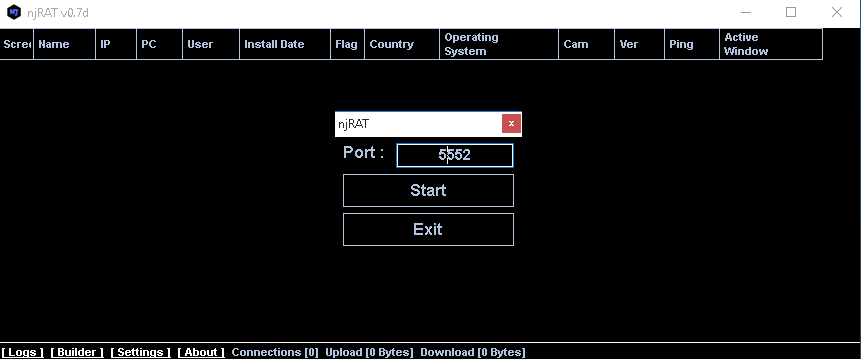
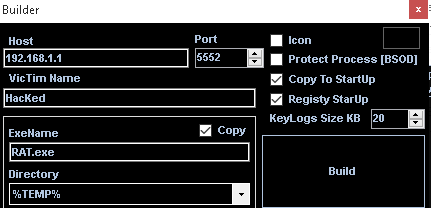
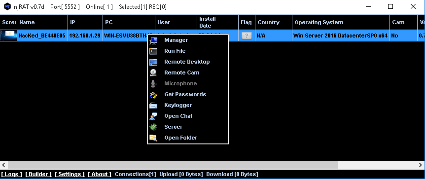
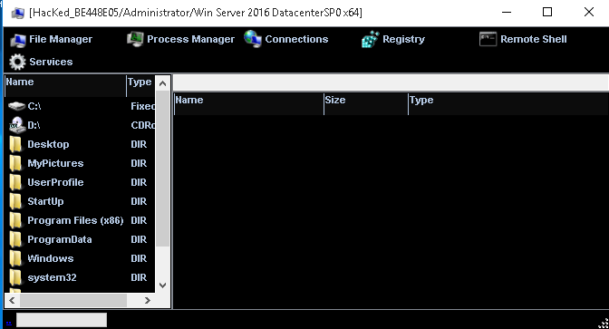

NjRAT is a Remote Access Trojan (RAT) creation tool. This allows the attacker to create a trojan which gives them full control of the victim's system. This tool is useful but it will be picked up by most antivirus programs.

NjRAT is a windows tool and we'll be attacking a Windows host with it. Once you've started NjRAT you will see a screen like the below.

On this screen we can select the port, for this we'll be keeping to the default. Click "Start", then in the bottom left corner click "Builder".

Change the host to the IP of the attacker device, make sure the rest of the settings are the same. Once you've done that click the big build button; you'll be asked where to save it.

Now that it's created and saved you'll have to get it across to your victim. This is the tricky part and I won't tell you how to do that here.

Once you've got it on the victim's machine they'll have to run it, if they do that a persistent connection will be created between you and the victim. It will look something like the below.

Well done! You now own the system. The connection will persist until they kill the process or turn off the device, if they turn the device off the connection will come back up when the device does.

Now you are able to do a number of things on the victim's machine, all you have to do is right-click.

If you click on the 'Manager' option a new screen will pop up. Here you can perform various actions on the host, including view/kill processes and active connections, view/change registry items, and perform file actions.

From that initial right-click menu you can also initiate a remote desktop connection, chat to the user, and perform keylogging type actions.