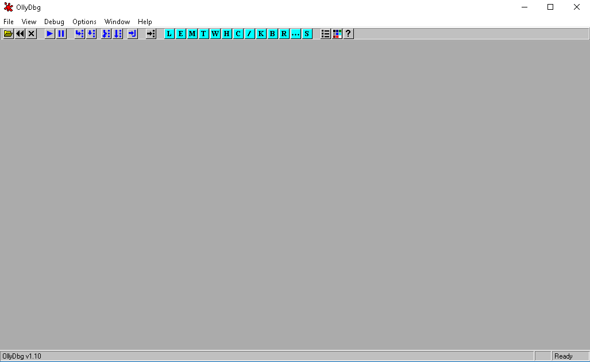
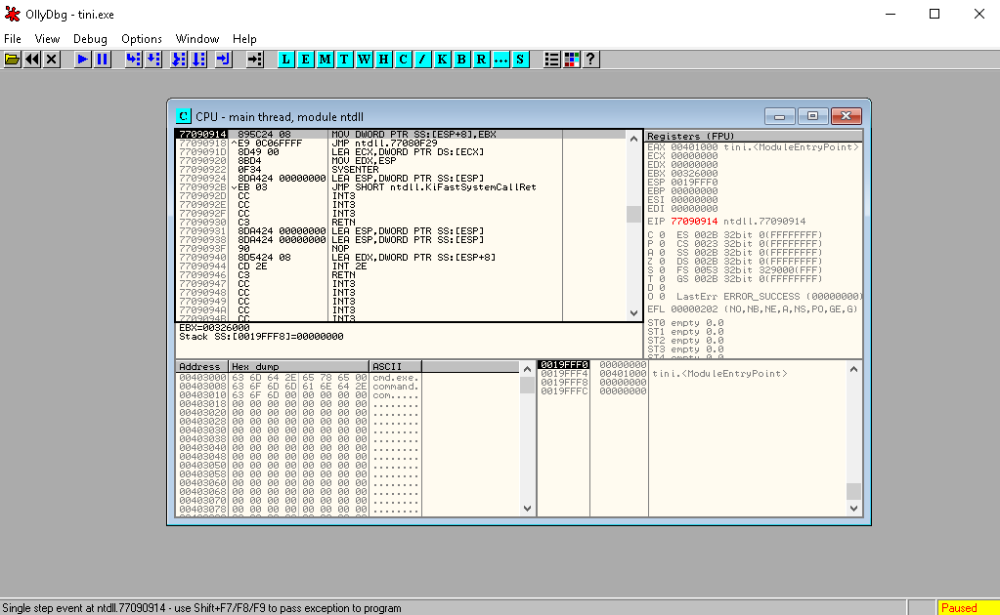
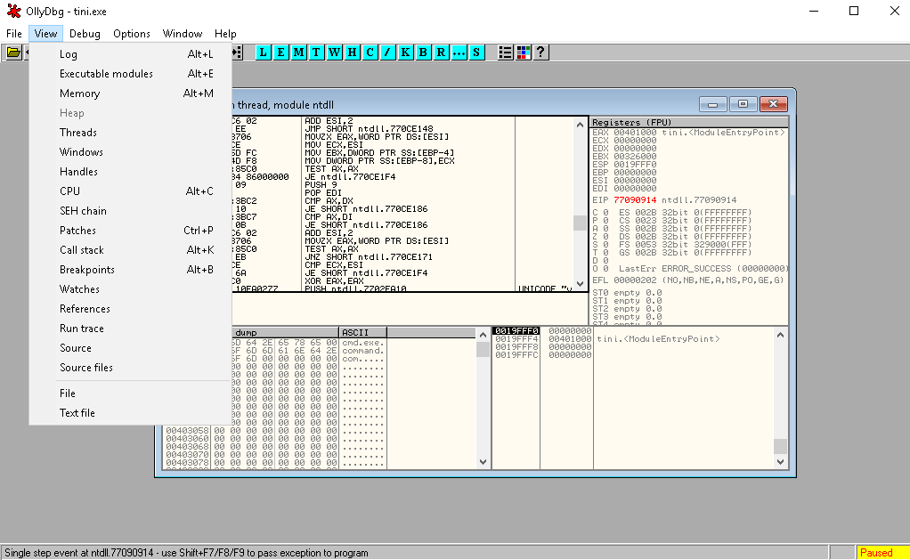
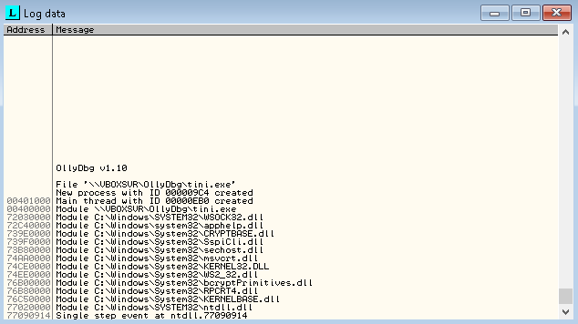
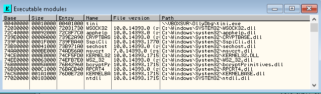
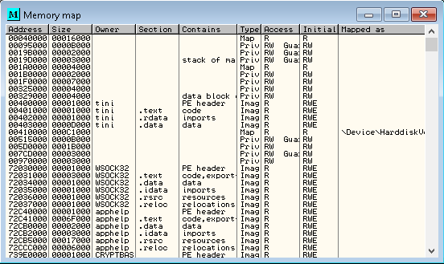
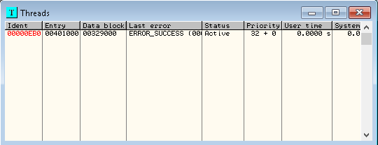

OllyDbg is a Windows tool to analyse binary files. This is good when the original source code is not available to you, which is a likely case if you have to analyse viruses and malware. OllyDbg will allow you to step through a program as it runs. For more information and to download <a className="nav-link mx-5 text-left" href="http://ollydbg.de/" target="_blank" rel="noopener noreferrer">click here.</a>

The UI is fairly simple when you first open the program.

Once you've got it opened you'll need to open a binary file. For the purpose of this I'll be opening an *exe* file. Once your file's opened you'll see that the UI looks a little more busy.

If you've never done this kind of thing before it will look a bit daunting at first and there is a skill to reading these types of files. I won't be teaching that here so we'll move onto some of the capabilities of the tool.

You are able to view a number of different aspects of an *exe* file.

Now I'll just show you a few of the different views so you get a flavour of what you're able to view.

Log data:

Executable Modules:

Memory:

Threads:

