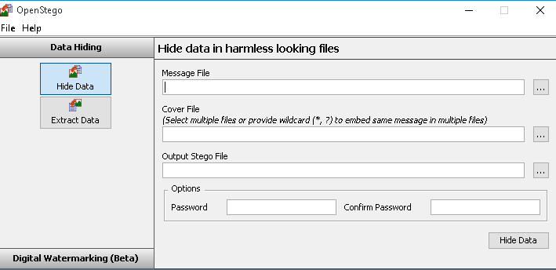
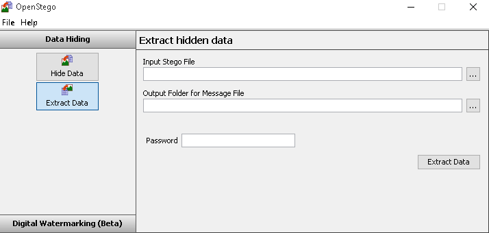

Steganography is the art of hiding information within other information. This is a fairly simple, yet powerful, technique that allows information to be hidden in plain site. This method of information obfuscation is great as you could upload an image to an image sharing website and no one, except the intended recipient, would know that there was a hidden message contained within.

OpenStego is a tool used for Steganography. It can be installed on Windows or Linux based systems, and is fairly easy to use. The initial screen should look like the below.

Like I said the software is fairly easy to use. You have to select a message file, which is the one you want to hide. 

Then select the cover file. This is the file you are hiding the message in, OpenStego requires an image file.

The output stego file is the output file. This will be saved in PNG format.

You can optionally set a password on the file. Once you've fulled in the options click 'Hide Data', the file will now be generated.

If you open the new file it will appear to be the image you covered the file with. What you can't see is the message you have hidden inside.

To extract the data you have hidden click the 'Extract Data' button and you will be presented with the below screen.

This screen is self-explanatory, so I won't explain it. Once you have filled in the required fields a file will be output. This will be the file you hid in the previous steps.