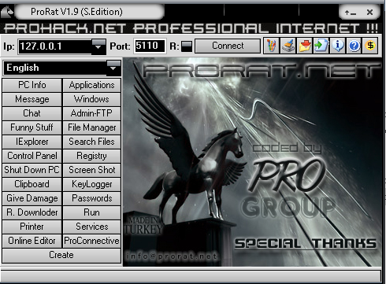
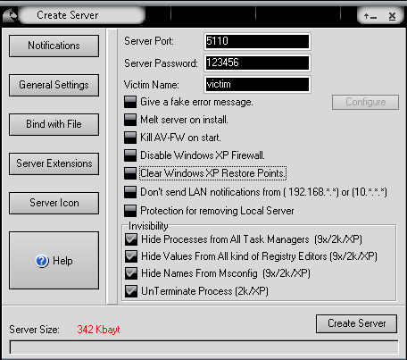
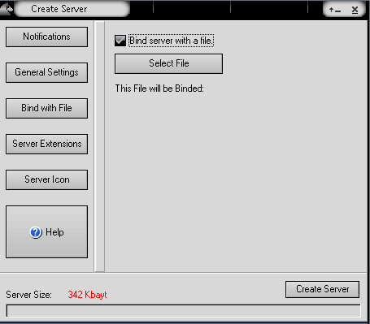
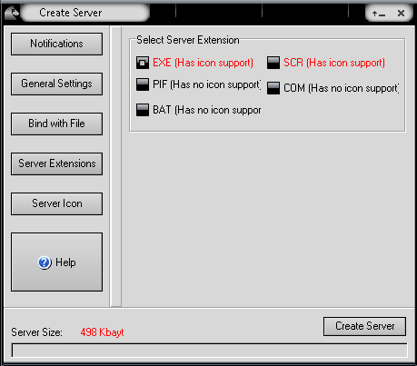

ProRat is another Remote Access Trojan (RAT) creation tool. It works on Windows systems and offers a number of features. **N.B.** This tutorial will require the firewall on the target to be either disabled or very poorly configured as the server will initiate the connection.

We'll first want to create a server, so click the create button (at the bottom) and pick the first option.

You can leave the notification settings as the defaults, but change the general settings so they look like the below.

Now use the 'Bind with File' option. This will allow you to attach the RAT with a file, I'll be binding to a jpg file.

In the 'Server Extensions' menu select the EXE option.

You can also set the server icon.

Once you've configured it how you want you can go ahead and create the server, this will create the server in the current directory.

Now you've created the malicious payload you have to get it over to the victim machine. I won't show you how to do this effectively.

When the victim is successfully compromised you will be able to connect via the IP address. You'll be prompted to enter a password, the default is 123456.

You now own the system. The user interface is pretty self-explanatory and you can perform a variety of malicious actions.