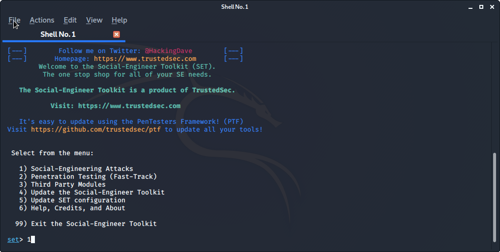
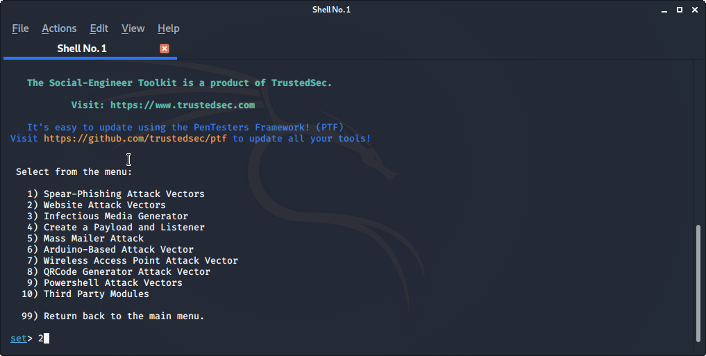
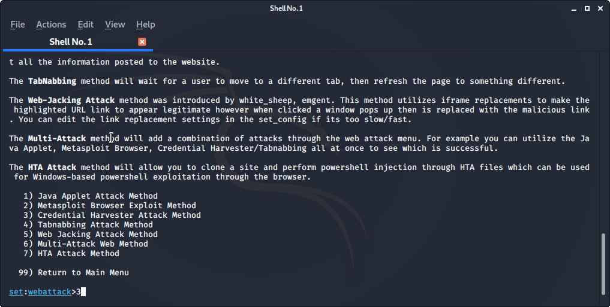
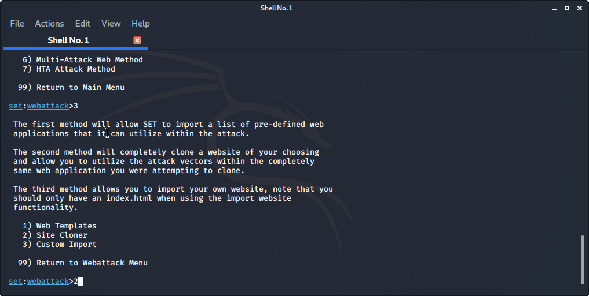
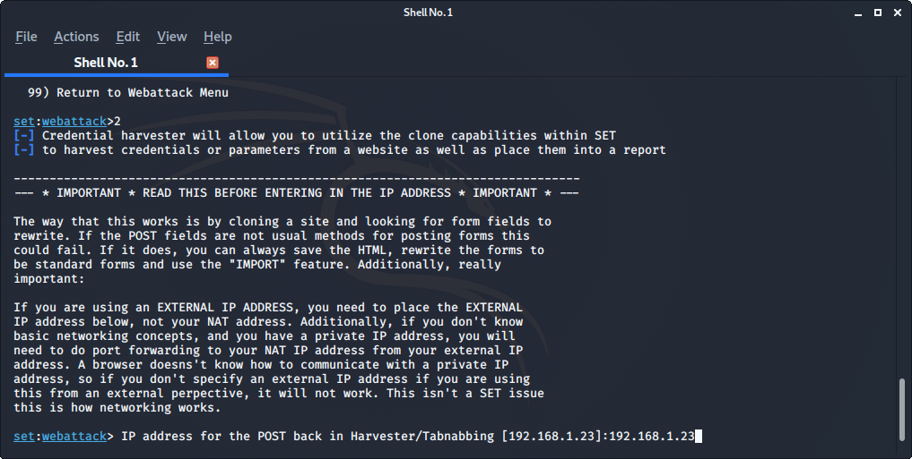
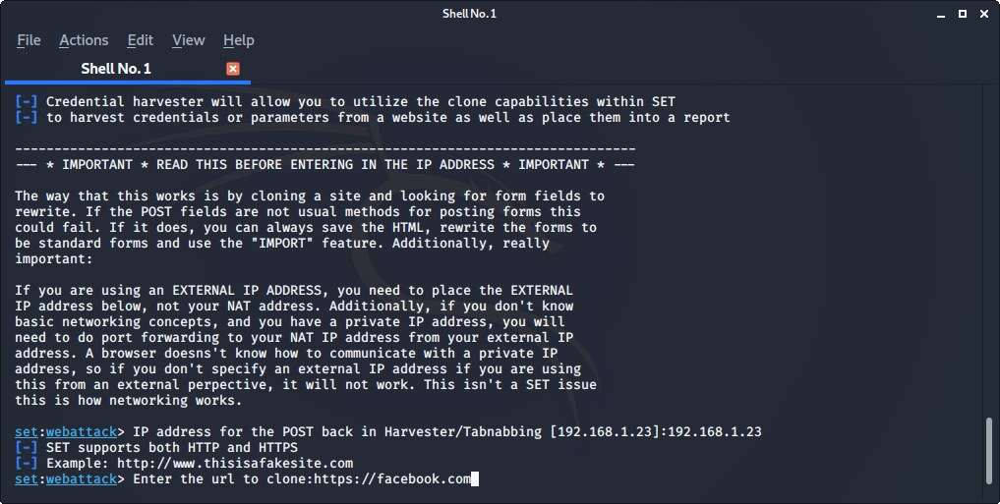
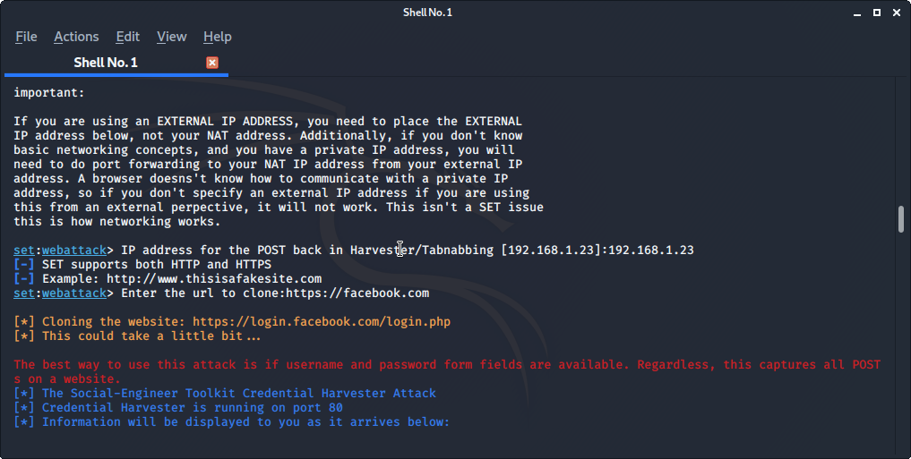
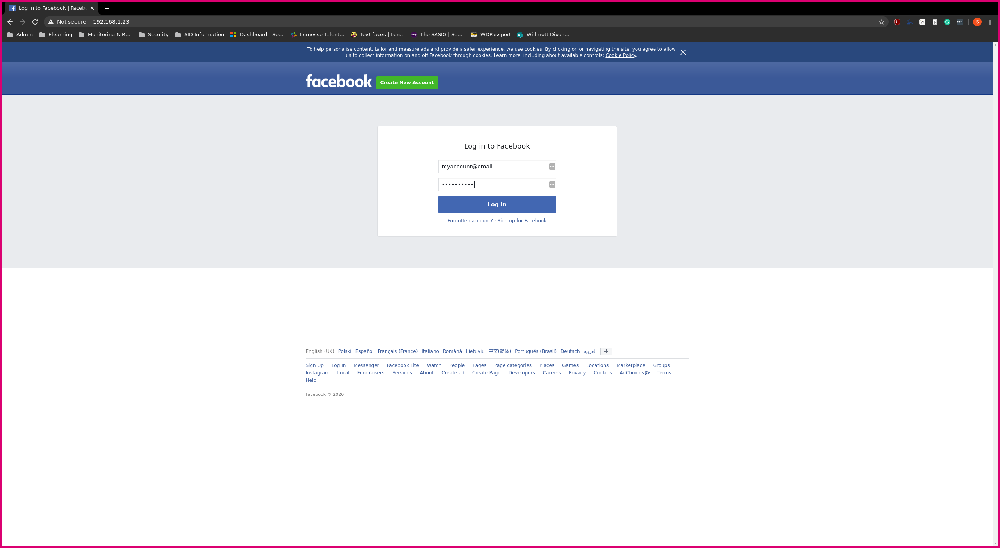
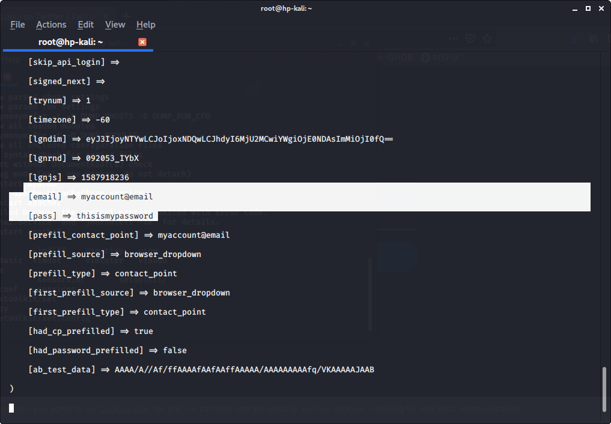

SET is a tool used for performing social engineering style attacks. It's a useful tool as it helps automate some of the manual tasks you would normally perform when trying to gain information about a target.

The tool is used in the command line one that comes as standard in Kali Linux. When you first open up SET you'll see something like the below.

We're going to be cloning the Facebook logon page and using it to harvest a user's credentials. This is a fairly simple but effective technique to trick a user into giving you their credentials. Follow these steps:

Now we'll set the IP address of the server we want this site to run on. I'm using the machine I'm using Kali on.

This next step is where we choose what website to clone. As you can see I'm using Facebook to clone, this will take a bit of time to complete the clone

Once the website is cloned and running you're screen will look something like the below. Just as a note you won't get any real output when the site is ready.

Now that it's up and running you have to get users to go to it, you can do this in a number of different way such as by email or putting the link on a webpage; I'll leave the how up to you. Wen the user browsers to the site they'll see something like the below:

You'll notice that the page here is not https or using the facebook.com URL in the top bar. This is a dead giveaway to the user. If you want this to be more convincing to the user you will have to use some additional methods. Please note if you're using Firefox the site may not display properly.

When a user browses to the page there will be a notification on SET with information. If they submit a password you'll see something like this:

Once the user has entered their credentials they will be redirected to the legitimate login page i.e. facebook.com.

#### Errors

If you get any problems with the tool giving errors when the user attempts to sign in you may have to do the following.

1. Open the file */etc/setoolkit/set.config*.
2. Find the line *APACHE_SERVER=OFF*
3. Change it to *APACHE_SERVER=ON*