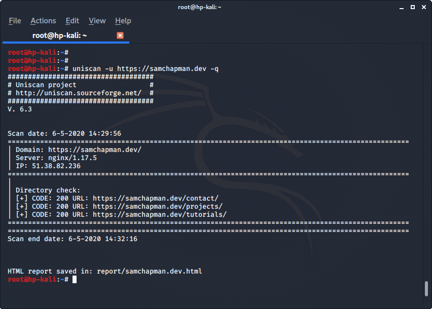
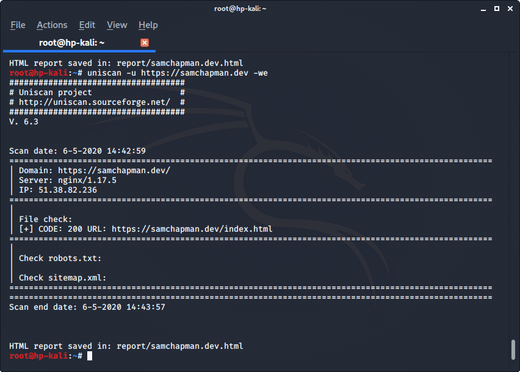
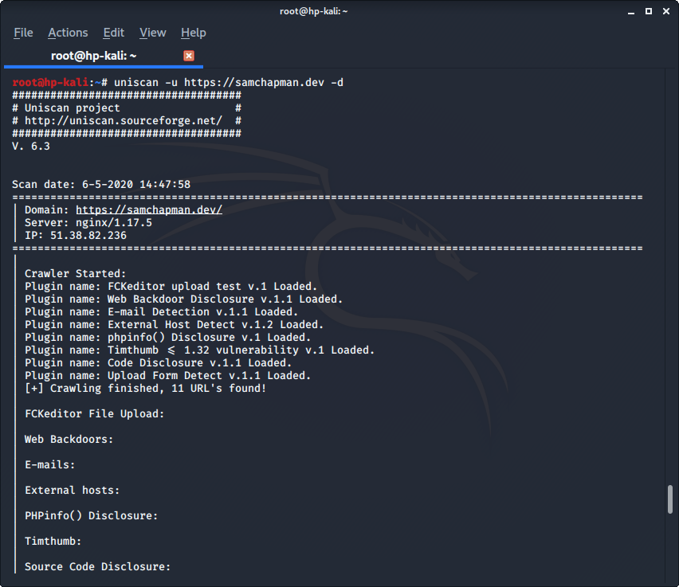

Uniscan is a tool for fingerprinting web servers in Kali Linux.

Simply typing 'uniscan' into the command line will show you options available to you.

The first scan we'll run will simply scan the page and traverse it's directories.

The next one use the *-we* option. This enables file checking and checks for *robots.txt* and *sitemap.xml* files.

Next we'll do a scan enabling dynamic checks. This one gives a wider set of results, they also won't likely fit on one page, in the image I've cut off the bottom of the output.

Uniscan will output the results of a scan to a folder, by default this will be */usr/share/uniscan/report/report/*.