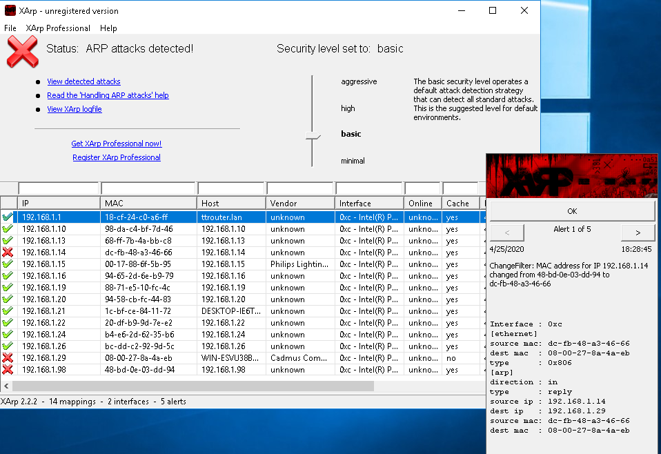

XArp is a tool that can assist in the detection of ARP based attacks. There are different levels of detection you can set to help limit the potential impact of the tool.

When you first open the tool it should look something like the below. Mine is showing that an attack has been detected, this is due to a currently running ARP poisoning attack that I have initiated.

The alerts window will alert you to any current attacks on your network. 

The tool itself will only determine whether the current subnet is under attack and is therefore only useful for this purpose. You should be aware that the different security levels will give you a different level of subnet scanning/inspection. The higher levels are more likely to detect an attack, however, they are also more likely to give you false-positives too, you must therefore find the right detection level for your network.