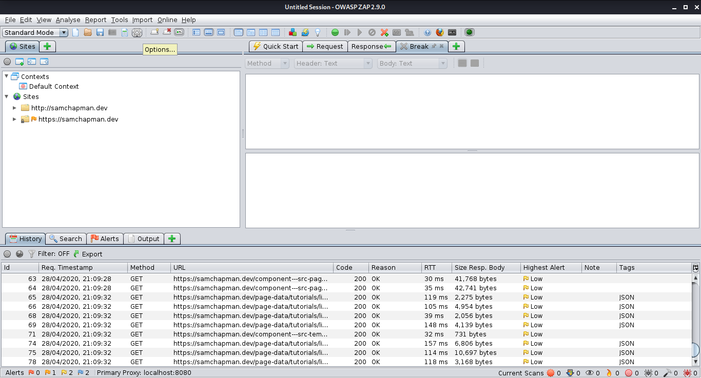

The Zed Attack Proxy (ZAP) is  an open source web app scanner. It's designed for web application testing and has been developed by OWASP; OWASP are an organisation that specialise in web application security and regularly produce articles, as well as a list of the top 10 web app security vulnerabilities. Zap is available on both Windows and Linux, I'll be using the Linux variant.

As an intercepting proxy it allows you to sit in between your browser and a web application and see all of the traffic going between them. You can then alter your requests as they go out to the web application and alter response as they come back, thus, allowing you to perform various tests on the security of the application. 

Before you start using ZAP you'll have to set your browser to use ZAP as a proxy. It will then proxy all requests and responses through ZAP. I'll guide you through this for Firefox, but other browsers will be different.

1. Go to 'Preferences'
2. Under the 'General' tab scroll to 'Network Settings' and click 'Settings...'

Fill in settings similar to the below.

Now you'll have to setup ZAP to receive traffic from your browser. 

Go to 'Options'.

Scroll to 'Local Proxies' and fill in details as below.

Your now ready to intercept traffic. To do that click 'Set break on all requests and responses'.

When requests go out you'll see it and have to allow it through.

This is where you can edit. This is a simple introduction but the tool is capable of much, much more. Things such as web app scanning, inspecting and altering session cookies, and more.